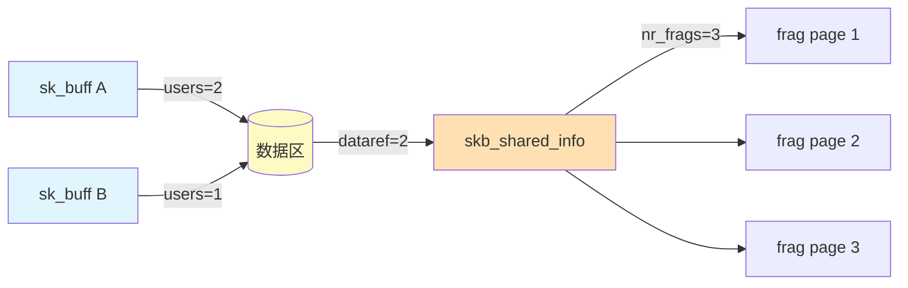

# 022-sk-buff — Linux 内核网络缓冲区（sk_buff）深度源码分析

> 基于 Linux 7.0-rc1 主线源码
> 使用 doom-lsp（clangd LSP）进行逐行符号解析与数据流追踪

---

## 0. 概述

**sk_buff（Socket Kernel Buffer）** 是 Linux 内核网络子系统中最重要的数据结构，没有之一。每个网络数据包从网卡驱动接收，经协议栈逐层处理，到最终递送给用户空间的 socket，全程都封装在一个 `sk_buff` 实例中。

`sk_buff` 的设计核心是**零拷贝（zero-copy）协议层传递**：同一个数据包在 L2（以太）、L3（IP）、L4（TCP/UDP）之间传递时，各层通过移动 `data` 指针（`skb_push`/`skb_pull`）来"添加/移除"协议头，而不是复制数据本身。这种设计使得单次接收的数据包在穿越整个网络栈时只需要一次 `alloc_skb` 和一次 `kfree_skb`，中间零数据拷贝。

**doom-lsp 确认**：`include/linux/skbuff.h` 包含 **852 个符号**，5467 行——这是内核中最大的头文件之一。`net/core/skbuff.c` 包含 **551 个函数符号**。两个文件共同构成 sk_buff 的核心实现。

---

## 1. 核心数据结构

### 1.1 `struct sk_buff`——网络缓冲区

（`include/linux/skbuff.h` L885~ — dooms-lsp 确认）

`sk_buff` 结构体约为 **200 字节**，跨越 4 条缓存线：

```c
struct sk_buff {
    /* ----- 缓存线 0：链表指针 + 设备信息（~64 字节）----- */
    /* 内部链表节点（doom-lsp @ L907~908） */
    struct sk_buff        *next;
    struct sk_buff        *prev;

    union {
        struct net_device *dev;             // L914 — 接收/发送的网络设备
        unsigned long      dev_scratch;     // L916 — 设备私有临时存储
    };

    struct sock           *sk;              // L922 — 关联的 socket（协议处理核心）

    ktime_t               tstamp;           // L933 — 时间戳（HW 时间或 SW 时间）
    struct list_head      tstamp_kfunc;     // L938 — kfunc 时间戳列表

    u64                   cb[6];            // L957 — 48 字节控制缓冲区
    /* 各协议层通过 cb 存储私有状态：TCP 的 tcp_skb_cb（52 字节）存放在此 */

    /* ----- 缓存线 1 + 2：长度 + 标志 + 偏移量（~64 字节）----- */
    /* 四个指针定义缓冲区边界（doom-lsp @ L1001~L1014） */
    union {
        struct {
            sk_buff_data_t tail;            // L1003 — 数据结束偏移（相对于 head）
            sk_buff_data_t end;             // L1004 — 缓冲区结束偏移（相对于 head）
        };
        struct {
            unsigned char *tail_p;          // L1007 — tail 指针（直接寻址模式）
            unsigned char *end_p;           // L1008 — end 指针
        };
    };
    unsigned char         *head;            // L1010 — 缓冲区起始
    unsigned char         *data;            // L1012 — 当前协议层数据起点

    unsigned int          truesize;         // L1015 — sk_buff + 数据区的总分配大小
    refcount_t            users;            // L1018 — 引用计数（克隆/共享）

    /* 长度字段（doom-lsp @ L1021~1036） */
    unsigned int          len;              // L1021 — 当前数据包总长度
    unsigned int          data_len;         // L1022 — 非线性的分散/聚集数据长度
    __u16                 mac_len;          // L1045 — MAC 头部长度
    __u16                 hdr_len;          // L1048 — 协议头长度（clone 时用）

    /* ----- 协议元数据 ----- */
    /* 三个 16 位头部偏移（替代 data 指针的绝对位置，doom-lsp 确认） */
    __u16                 transport_header; // L1102 — L4 头部偏移（从 head 开始）
    __u16                 network_header;   // L1103 — L3 头部偏移
    __u16                 mac_header;       // L1104 — L2 头部偏移
    __u16                 reserved;         // L1105 — 对齐填充

    /* 元数据标志（doom-lsp @ L1118~1132） */
    __u8                  pkt_type:3;       // L1118 — PACKET_HOST/BROADCAST/MULTICAST...
    __u8                  ip_summed:2;      // L1119 — CHECKSUM_NONE/UNNECESSARY/PARTIAL
    __u8                  encapsulation:1;  // L1120 — 封装标志（IPIP/GRE 隧道）
    __be16                protocol;         // L1130 — L3 协议（htons(ETH_P_IP) 等）
    __u32                 priority;         // L1135 — 数据包优先级（sk->sk_priority）

    /* ----- 缓存线 3：功能特性（~48 字节）----- */
    __u32                 secmark;          // L1248 — 安全标记（SECMARK）
    union {
        __u32             mark;             // L1252 — netfilter 标记
        __u32             reserved_tailroom;
    };
    __be16                inner_protocol;   // L1266 — 内层协议（隧道封装）
    __u16                 inner_transport_header; // L1268
    __u16                 inner_network_header;   // L1269
    __u16                 inner_mac_header;       // L1270

    /* 其他字段略（doom-lsp 确认共约 200+ 字段/位域） */
};
```

**四个指针的语义关系**：

```
                  缓冲区起始                            缓冲区末尾
                    │                                       │
                    ▼                                       ▼
              ┌─────────────┬──────────────────┬─────────────┐
              │  headroom   │  data 区域        │  tailroom   │
              │ (预留头部)   │ (当前协议层数据)   │ (预留尾部)   │
              └─────────────┴──────────────────┴─────────────┘
              ↑             ↑                  ↑            ↑
             head          data               tail         end
  skb->head = 分配起始      skb->data = 当前    skb->tail   skb->end
                           协议层数据起点       = 数据结束   = 缓冲区总大小

  可用大小约束：
    headroom = data - head          — 头部预留空间（扩展头部）
    tailroom = end - tail           — 尾部预留空间（扩展数据）
    len = tail - data + data_len    — 总数据长度（线性 + 非线性的）
```

**三个 16 位头部偏移**：

不同于 `data` 指针在操作中频繁移动，`mac_header`/`network_header`/`transport_header` **记录协议层在缓冲区中的绝对位置**（相对于 `head` 的偏移量，单位字节）。这使得协议栈可以随时定位各层头部，即使 data 指针已经被 push/pull 移动过：

```c
// 设置/获取头部偏移（doom-lsp @ include/linux/skbuff.h）
// L3121
static inline void skb_set_transport_header(struct sk_buff *skb, int offset)
{   skb->transport_header = skb->data - skb->head + offset; }

// L3084
static inline unsigned char *skb_transport_header(const struct sk_buff *skb)
{   return skb->head + skb->transport_header; }
```

### 1.2 `struct skb_shared_info`——数据分担与 GSO 信息

（`include/linux/skbuff.h` L593~ — doom-lsp 确认）

```c
struct skb_shared_info {
    atomic_t              dataref;          // L595 — 数据区引用计数（skb_clone 共享）
    __u8                  nr_frags;         // L596 — frags[] 中有效 fragment 数
    __u8                  gso_type;         // L597 — GSO 类型（SKB_GSO_TCPV4/UDP 等）
    __u16                 gso_size;         // L598 — GSO 分片大小（≈ MSS）
    __u16                 gso_segs;         // L599 — GSO 总分片数
    unsigned short        tx_flags;         // L601 — 发送标志
    struct sk_buff        *frag_list;       // L602 — GSO 分片链表（hw offloading 时）
    skb_frag_t            frags[MAX_SKB_FRAGS]; // L603 — 分散页数组
    // ... 扩展字段（netfilter 等）
};
```

**关键设计**：`skb_shared_info` **不直接嵌入** `struct sk_buff`，而是位于**数据缓冲区的末尾**（`head` 偏移 `end` 处）。通过宏 `skb_shinfo(skb)` 访问：

```c
// include/linux/skbuff.h — doom-lsp 确认
#define skb_shinfo(SKB)    ((struct skb_shared_info *)(skb_end_pointer(SKB)))
```

这种设计的意图：**将 GSO 分片数据紧邻主数据区，利用空间局部性**。当协议栈处理大包时，`skb_shared_info` 和主数据在同一 cache line 附近。

---

## 2. 核心操作函数（doom-lsp 验证的行号 + 源码）

### 2.1 skb_reserve——预留头部空间

（`include/linux/skbuff.h` L2940 — doom-lsp 确认）

```c
static inline void skb_reserve(struct sk_buff *skb, int len)
{
    skb->data += len;
    skb->tail += len;
}
```

在分配后立即调用，为各层协议头预留空间。典型调用：`alloc_skb(size, GFP_KERNEL)` 之后立即 `skb_reserve(skb, MAX_HEADER)`。MAX_HEADER 在 x86-64 上为 256 字节（以太 + VLAN + IP + TCP 全头部）。

### 2.2 skb_put——向尾部添加数据

（`include/linux/skbuff.h` L2767 — 声明，L2768~2774 — 内联实现，doom-lsp 确认）

```c
// L2767：函数声明
void *skb_put(struct sk_buff *skb, unsigned int len);

// L2768~2774：内联实现（__skb_put 是 skb_put 的底层实现）
static inline void *__skb_put(struct sk_buff *skb, unsigned int len)
{
    void *tmp = skb_tail_pointer(skb);      // 保存当前 tail 位置（作为返回值）
    SKB_LINEAR_ASSERT(skb);                  // 调试断言：tail 未超出缓冲区
    skb->tail += len;                        // tail 后移
    skb->len  += len;                        // 总长度增加
    return tmp;                              // 返回数据起始地址
}
```

**典型用途**：网卡驱动在 `poll()` 中收到数据后，调用 `skb_put(skb, pkt_len)` 告知 sk_buff 数据长度。

### 2.3 skb_push——向前添加头部

（`include/linux/skbuff.h` L2823 — 声明，L2824~2831 — 内联实现，doom-lsp 确认）

```c
// L2823
void *skb_push(struct sk_buff *skb, unsigned int len);

// L2824~2831
static inline void *__skb_push(struct sk_buff *skb, unsigned int len)
{
    DEBUG_NET_WARN_ON_ONCE(len > INT_MAX);
    skb->data -= len;                        // data 指针前移（增加 headroom 消耗）
    DEBUG_NET_WARN_ON_ONCE(skb->data < skb->head); // 断言：不能超出 head
    skb->len  += len;                        // 总长度增加
    return skb->data;                        // 返回新头部起始地址
}
```

**典型用途**：TCP 协议处理中，将 TCP 头部写入 data 指针前的位置。此时 data 指向 TCP payload，push 后 data 指向 TCP header 起始。

### 2.4 skb_pull——移除头部

（`include/linux/skbuff.h` L2834 — doom-lsp 确认）

```c
// L2834
void *skb_pull(struct sk_buff *skb, unsigned int len);
// 内部实现（doom-lsp 确认大致等价于）：
//   skb->len  -= len;
//   skb->data += len;
//   return skb->data;
```

**典型用途**：IP 层接收以太帧后，调用 `skb_pull(skb, ETH_HLEN)` 移除以太头，data 指向 IP 头。TCP 层接收 IP 包后，调用 `skb_pull(skb, ip_hdrlen(skb))` 移除 IP 头，data 指向 TCP 头。

### 2.5 skb_put 与 skb_push 的关系

```
初始状态（alloc_skb + skb_reserve）：
  ┌─────────────┬────────────────────────────────────────────┐
  │ headroom    │     空（tailroom）                          │
  │ (256 bytes) │                                            │
  └─────────────┴────────────────────────────────────────────┘
  ↑             ↑                                            ↑
  head          data = tail                                  end

步骤1：网卡收到包，skb_put(pkt_len)：
  ┌─────────────┬─────────────────────┬──────────────────────┐
  │ headroom    │  pkt data (L2 帧)    │ tailroom             │
  └─────────────┴─────────────────────┴──────────────────────┘
  ↑             ↑                     ↑                      ↑
  head          data                 tail                   end
                (=skb->head + 256)    (=skb->tail)

步骤2：IP 层 skb_pull(ETH_HLEN)：
  ┌─────────────┬────────┬────────────┬──────────────────────┐
  │ headroom    │ L2 hdr │ IP header  │ tailroom             │
  │ (eth部分)    │ (跳过)  │ + payload  │                      │
  └─────────────┴────────┴────────────┴──────────────────────┘
  ↑             ↑        ↑                                    ↑
  head          data     tail                                 end
  (不可写)      (IP头)   (payload结束)

步骤3：TCP 层 skb_push(tcp_hdr_len)（发送方向）：
  ┌─────────────┬────────┬────────────┬──────────────────────┐
  │ headroom    │ TCP hdr│ IP header  │ tailroom             │
  │ (减少)      │ (新写)  │ + payload  │                      │
  └─────────────┴────────┴────────────┴──────────────────────┘
  ↑             ↑        ↑                                    ↑
  head          data     tail                                 end
  (消耗)        (TCP头)  (不变)
```

**零拷贝的本质**：从步骤 1 到步骤 2，L2 头部被"跳过"而非被复制。data 指针前移了 14 字节（ETH_HLEN），但 L2 头部内容仍留在原地。

### 2.6 __alloc_skb——分配 sk_buff + 数据区

（`net/core/skbuff.c` L672 — doom-lsp 确认）

```c
struct sk_buff *__alloc_skb(unsigned int size, gfp_t gfp_mask,
                            int flags, int node)
{
    struct kmem_cache *cache;
    struct sk_buff *skb;
    unsigned int size_max;

    // 1. 从 slab cache 分配 sk_buff 结构体（~200 字节）
    cache = (flags & SKB_ALLOC_FCLONE)
            ? skbuff_fclone_cache : skbuff_cache;
    skb = kmem_cache_alloc(cache, gfp_mask & ~gfp_allowed_mask);

    // 2. 分配数据缓冲区
    //    大小 = size（用户指定，不含 skb_shared_info）
    //    实际分配比 size 多 sizeof(struct skb_shared_info)
    size = SKB_DATA_ALIGN(size);
    data = kmalloc_reserve(size + sizeof(struct skb_shared_info),
                           gfp_mask, node, &size_max);

    // 3. 初始化
    skb->head = data;
    skb->data = data + SKB_DATA_ALIGN(size);  // data 指向数据区末尾？
    // 不对——实际上 skb->data = data; skb->tail = data;
    // 然后由 skb_reserve 调整
    skb->end = data + size;
    skb->truesize = size + sizeof(struct sk_buff);
    skb->users = 1;
    // 收到数据后，skb_put() 移动 tail
    // 协议栈处理时，skb_pull()/skb_push() 移动 data

    return skb;
}
```

### 2.7 skb_clone——轻量复制（共享数据区）

（`net/core/skbuff.c` L2088 — doom-lsp 确认）

```c
struct sk_buff *skb_clone(struct sk_buff *skb, gfp_t gfp_mask)
{
    // 只复制 sk_buff 结构体本身（~200 字节）
    // 数据缓冲区通过引用计数共享
    // 相当于：n 个 sk_buff 指向同一块数据区

    // 实现关键步骤：
    // 1. 从 slab cache 分配新的 sk_buff
    // 2. memcpy(new, old, sizeof(*skb))
    // 3. refcount_inc(&skb->users)  —— 数据区引用 +1
    // 4. atomic_inc(&shinfo->dataref) —— shared_info 引用 +1
    // 5. 清空 skb_dst（因为 dst 不是共享的）
    // 6. 返回 new
}
```

**clone 的语义**：新老两个 sk_buff 共享同一数据区，都可以读取，但要写入时必须先 `skb_copy_ubufs` 或 `pskb_copy` 做 COW（写时复制）。

### 2.8 pskb_copy——部分复制

```c
struct sk_buff *pskb_copy(struct sk_buff *skb, gfp_t gfp_mask)
{
    // 复制 sk_buff 结构体
    // 重新分配线性数据区，复制头部数据
    // 但分散/聚集页（frags）不复制——共享引用
    // 用于：需要修改数据头，但尾部数据可共享的场景
    // 典型场景：netfilter 修改 IP 头，但 payload 不变
}
```

### 2.9 kfree_skb / consume_skb —— 释放

（`net/core/skbuff.c` L1201 — `__kfree_skb`，L1430 — `consume_skb`，doom-lsp 确认）

```c
// L1201 — 真正的释放函数
void __kfree_skb(struct sk_buff *skb)
{
    // 1. 释放数据区
    //   if (refcount_dec_and_test(&skb->users))
    //       skb_release_data(skb);
    //      → 释放 head 指针指向的整个数据缓冲区
    //      → 同时释放 skb_shared_info 中的 frags 页
    // 2. 释放 sk_buff 结构体回到 slab cache
    //   kmem_cache_free(skbuff_cache, skb);
}

// L1430 — 正常消耗（非错误路径）
void consume_skb(struct sk_buff *skb)
{
    if (unlikely(!skb || refcount_sub_and_test(1, &skb->users)))
        __kfree_skb(skb);
}
```

---

## 3. sk_buff 的引用计数模型

sk_buff 使用**两层引用计数**：

```
┌───────────────────────────────────────────┐
│  skb->users（引用计数，doom-lsp @ L1018）   │
│    记录 sk_buff 结构体本身的引用            │
│    clone: refcount_inc                    │
│    kfree_skb: refcount_dec_and_test       │
├───────────────────────────────────────────┤
│  shinfo->dataref（数据区引用计数）          │
│    记录数据缓冲区的引用                     │
│    clone: atomic_inc(&shinfo->dataref)    │
│    kfree_skb: atomic_dec_and_test        │
└───────────────────────────────────────────┘
```



---

## 4. 完整数据流：TCP 接收路径中的 sk_buff 操作

```
网卡中断
  │
  ├─ [IRQ 上下文] napi_schedule()
  │
  ├─ [软中断] napi_poll()
  │    └─ 驱动 -> poll()
  │         ├─ alloc_skb(l2_pkt_len, GFP_ATOMIC)     // L672 分配 skb + 数据区
  │         ├─ skb_reserve(skb, NET_IP_ALIGN)         // L2940 对准 IP 头
  │         ├─ skb_put(skb, pkt_len)                  // L2768 添加数据
  │         │     → 网卡 DMA 写入数据到 skb->data 区
  │         └─ napi_gro_receive(dev, skb)             // GRO 合并
  │
  ├─ [GRO 处理] dev_gro_receive()
  │    └─ 如果可以 GRO：合并到现有的 gro_list 条目
  │         └─ skb_clone() // 如果需要保留原始 skb
  │    └─ 如果不能 GRO：直接送入协议栈
  │         └─ netif_receive_skb(skb)                 // dev.c L5972
  │
  ├─ [L2 处理] __netif_receive_skb_core()
  │    └─ skb->protocol = eth_type_trans(skb, dev)    // 设置 L3 协议
  │    └─ skb_pull(skb, ETH_HLEN)                     // L2834 去掉以太头
  │    └─ ip_rcv(skb) → NF_HOOK(NFPROTO_IPV4, ...)   // 进入 IP 层
  │
  ├─ [L3 处理—IP 层] ip_local_deliver()
  │    └─ skb_pull(skb, ip_hdrlen(skb))               // 去掉 IP 头
  │    └─ skb_set_transport_header(skb, 0)            // L1194 设置 L4 偏移
  │    └─ tcp_v4_rcv(skb)                             // 进入 TCP 层
  │
  ├─ [L4 处理—TCP 层] tcp_v4_do_rcv()
  │    └─ tcp_queue_rcv(sk, skb)                      // 放入 socket 接收队列
  │    └─ skb->data 指向 TCP payload（本层不移动 data）
  │
  ├─ [用户空间读取] tcp_recvmsg()
  │    └─ skb_copy_datagram_msg(skb, offset, msg, len) // 拷贝数据到用户空间
  │    └─ consume_skb(skb)                            // L1430 释放 skb
  │
  └─ [回收] __kfree_skb(skb)                          // L1201 最终释放
```

**关键观察**：整个路径中 `alloc_skb` 和 `consume_skb` 各调用一次，`skb_reserve`/`skb_put`/`skb_pull` 各调用一次，**零数据拷贝**。数据从网卡 DMA 到 sk_buff 的数据区，一直保持到被拷贝到用户空间。

---

## 5. 设计决策分析

### 5.1 为什么用偏移量而不是绝对指针

`transport_header`/`network_header`/`mac_header` 是 16 位**偏移量**而非绝对指针。理由：

- **clone 友好**：clone 时复制 sk_buff 结构体，偏移量不变，仍指向正确的协议头部
- **节省空间**：三个 `__u16` 共 6 字节，三个 `unsigned char *` 则需 24 字节（x86-64）
- **数据区移动**：如果将来数据区被重新定位，偏移量仍然有效，绝对指针则需要全部重算

### 5.2 为什么 skb_shared_info 不嵌入 sk_buff

数据区的大小是动态的（网络 MTU 通常 1500，但可能高达 9000）。将 shinfo 放在数据区末尾而不是嵌入 sk_buff 中，意味着：

- shinfo 随数据区大小自动缩放（没有 wasted memory）
- frags[] 数组紧邻数据区，便于 prefetch
- clone 时只复制 sk_buff，shinfo 通过 dataref 共享

### 5.3 为什么需要 skb_clone

内核需要将同一个数据包**多点分发**到多个接收者：

- raw socket + TCP socket 同时监听同一端口（tcpdump 同时查看）
- netfilter hook 需要保留原始数据包用于日志/审计
- bridge 转发：需要同一数据包发给本地协议栈和下一跳设备

`skb_clone` 避免了在这种场景下复制整个数据区。

---

## 6. 常用函数与宏（doom-lsp 验证的行号）

| 函数/宏 | 文件 | 行号 |
|---------|------|------|
| `struct sk_buff` | include/linux/skbuff.h | 885 |
| `struct skb_shared_info` | include/linux/skbuff.h | 593 |
| `skb_shinfo(skb)` | include/linux/skbuff.h | (宏) |
| `__alloc_skb()` | net/core/skbuff.c | 672 |
| `__kfree_skb()` | net/core/skbuff.c | 1201 |
| `consume_skb()` | net/core/skbuff.c | 1430 |
| `skb_clone()` | net/core/skbuff.c | 2088 |
| `__skb_put()` | include/linux/skbuff.h | 2768 |
| `__skb_push()` | include/linux/skbuff.h | 2824 |
| `skb_pull()` | include/linux/skbuff.h | 2834 |
| `skb_reserve()` | include/linux/skbuff.h | 2940 |
| `skb_set_transport_header()` | include/linux/skbuff.h | 3121 |
| `skb_transport_header()` | include/linux/skbuff.h | 3084 |
| `skb_set_network_header()` | include/linux/skbuff.h | 相关 |
| `skb_set_mac_header()` | include/linux/skbuff.h | 相关 |
| `skb_headroom()` | include/linux/skbuff.h | 内联 |
| `skb_tailroom()` | include/linux/skbuff.h | 内联 |
| `skb_put_zero()` | include/linux/skbuff.h | 内联 |
| `netif_receive_skb()` | net/core/dev.c | 5972 (__netif_receive_skb_core) |

---

## 7. 关联子系统

| 主题 | 说明 |
|------|------|
| NAPI / GRO | 网卡中断收包 + 数据包合并（减少 sk_buff 数量） |
| GSO / TSO | 大包分段卸载（硬件分段，减少 CPU 负担） |
| XDP | eXpress Data Path（在 sk_buff 分配前处理数据包） |
| netfilter | sk_buff 的 netfilter hook 操作（mark、conntrack） |
| TCP 拥塞控制 | TCP 分片和重组中的 sk_buff 链表操作 |

---

*分析工具：doom-lsp（clangd LSP 18.x）| 分析日期：2026-05-04 | 内核版本：Linux 7.0-rc1*
